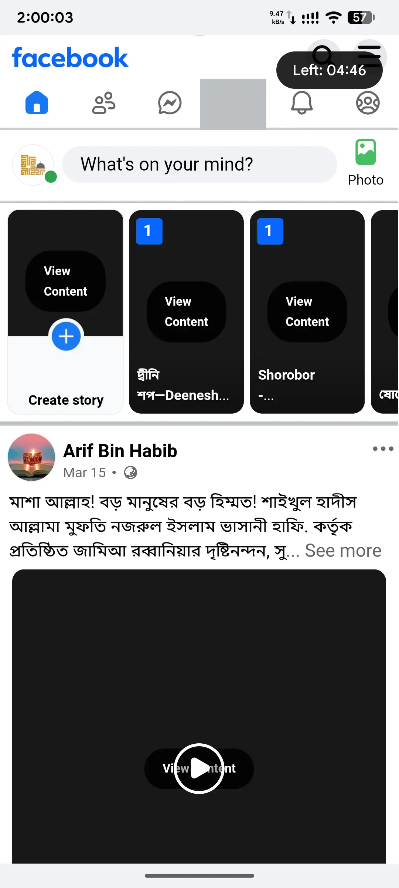
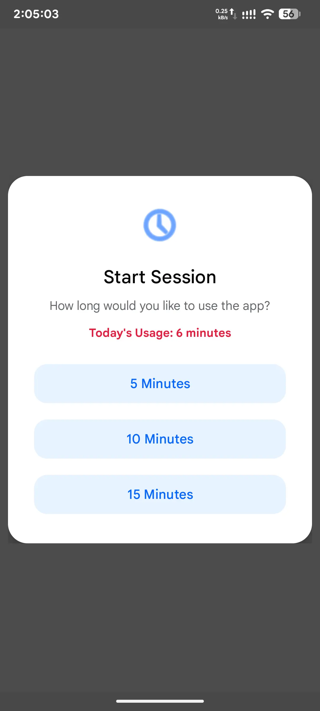
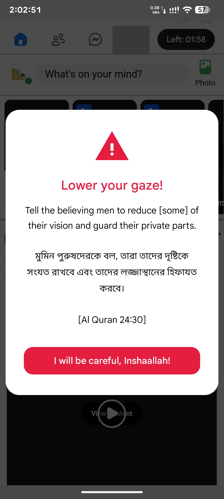
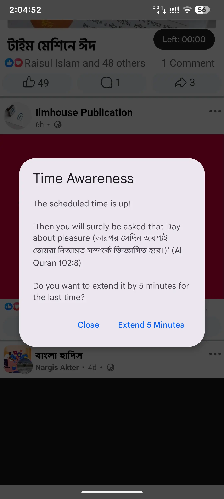
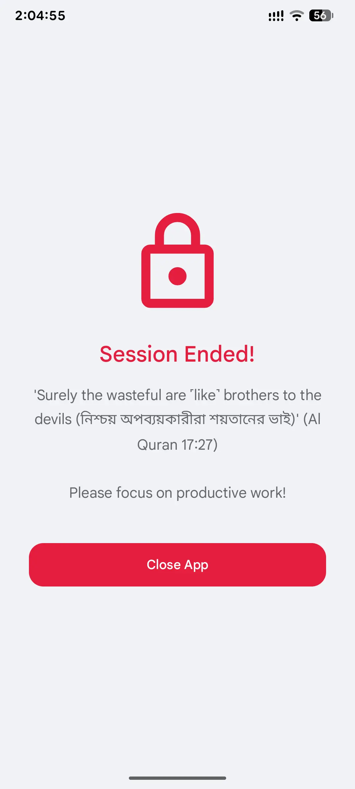

# 📱 PureFacebook

  

  <b>Reclaim Your Time. Guard Your Gaze. Browse with Purpose.</b> 
  <i>An ethical, distraction-free Facebook experience for the modern Ummah.</i>

  
  
  
  

---

## 📥 Direct Download (Latest Version)

> [!TIP]
> **Ready to boost your productivity?** Click the button below to download the latest APK directly from our official releases.

  

---

## 📸 Interface Preview

  
  
  

  
  
  

*Tip: Click on an image to view it in full size.*

---

## 📖 The Philosophy

In a world of infinite scrolling and dopamine-driven hooks, our time is our most valuable asset. **PureFacebook** is designed as a productivity tool that respects your mental health and spiritual boundaries. It transforms a chaotic social media platform into a focused utility.

---

## ✨ Core Features

### 🛡️ Digital Discipline
* **🚫 Reels Sanitization:** Automatically detects and hides Reels and short-video elements to kill the scrolling loop.
* **👁️ Guard the Gaze:** All images and videos are blurred by default. You only view content when you intentionally click "View Content".
* **📢 Ad-Free Feed:** Actively filters "Sponsored" posts and promotional interruptions.

### ⏱️ Intentional Browsing
* **⏳ Session Limits:** Choose between 5, 10, or 15-minute windows for focused browsing.
* **🔒 Hard Blocking:** Once your time (and one extension) is up, the app locks to keep you productive.
* **📈 Daily Insights:** Monitor your total daily usage directly from the dashboard.

### 📖 Spiritual Reminders
* **Heart Softeners:** Displays periodic quotes from the **Quran and Sunnah** to remind you of your true purpose and the value of time.

---

## 🛠️ Tech Stack & Architecture

PureFacebook is built using a secure `WebView` wrapper with custom JavaScript and CSS injection to ensure speed, privacy, and full control over the DOM.

| Component | Technology |
| :--- | :--- |
| **Language** | Kotlin |
| **UI Framework** | Material Design 3 |
| **Data Synchronization** | Remote JSON-based Dynamic Warnings |
| **Security** | Enforced SSL & HTTPS |
| **Minimum SDK** | 24 (Android 7.0) |

---

## 🔒 Security & Ethical Standards

> [!IMPORTANT]
> **We respect your privacy.**
> * **No Data Storage:** We do not see, store, or transmit your login credentials.
> * **Direct Connection:** The app connects directly to the official Facebook mobile web servers.
> * **Clean Code:** 100% open-source with no background tracking or hidden scripts.

---

## 📥 Installation

1.  **Download:** Grab the latest `.apk` from the [Releases](https://github.com/3elegant/PureFacebook/releases/latest) tab.
2.  **Permissions:** Allow installation from "Unknown Sources" if prompted by Android.
3.  **Login:** Sign in to your Facebook account securely through the official web interface.

---

## 🤝 Support the Mission

Contributions are highly valued. If you have ideas for improving the filtering algorithms or adding new spiritual reminders:

1.  **Fork** the project.
2.  **Create** a feature branch (`git checkout -b feature/NewFeature`).
3.  **Submit** a Pull Request.

---

## 📄 License

This project is intended for **personal and educational use**. It is a community-driven effort to promote digital wellbeing.

  <b>Built with ❤️ for a better Ummah.</b>

